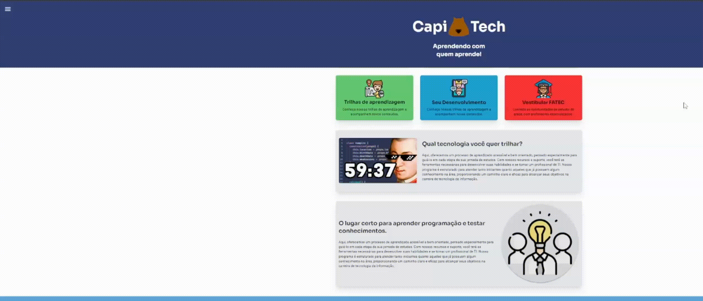
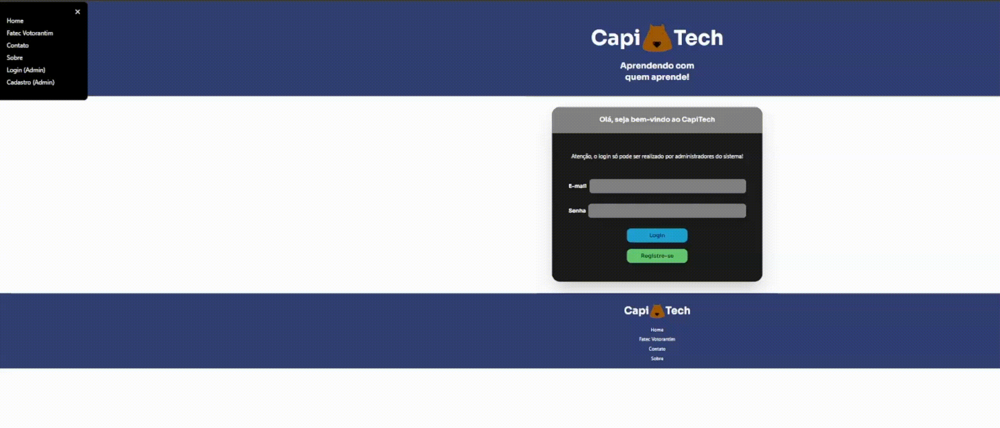
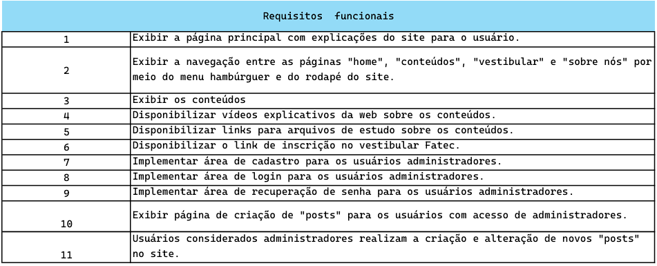
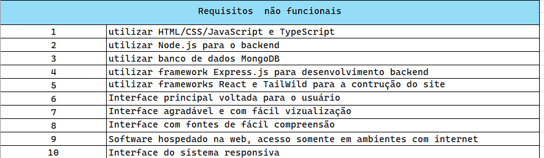
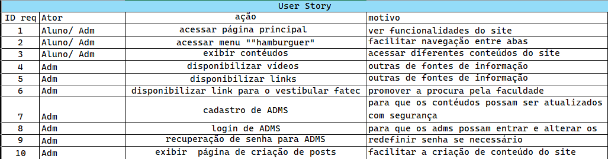

 

  <a href="#sobre">Sobre</a> •  
  <a href="#actions">Git Flow</a> •  
  <a href="#backlogs">User Stories</a> •  
  <a href="#prototipo">Protótipo & Documentação</a> •  
  <a href="#tecnologias">Tecnologias</a> •  
  <a href="#equipe">Equipe</a>

---

## :bookmark_tabs: Sobre o projeto 

O projeto consiste em um site voltado para **educação**, com foco em fornecer ensino gratuito e de qualidade para pessoas interessadas em ingressar no **desenvolvimento tecnológico**.

Este projeto visa:

- Democratizar o acesso à educação tecnológica.
- Oferecer uma plataforma inclusiva e gratuita.
- Promover a inovação e a inclusão digital.
- Direcionar e recomendar cursos / pessoas com o mesmo propósito

> **Metodologia:** _Ágil SCRUM_  
> :pushpin: **Status do Projeto:** Concluído ✅

### :clapper: Funcionalidades

  
<strong>Usuário Administrador</strong>

  
  - Registro  
    
  - Login  
    
  - Cadastro de Curso  
    

  
<strong>Usuário Comum</strong>

  
  - Acesso ao site (Home Page)  
    
  - Acesso aos conteúdos  
    

🔝 [Voltar ao topo](#topo)

---

## 💻 Git Flow 

Padronizamos os commits para manter um histórico de desenvolvimento claro e organizado.

### :bookmark_tabs: Padrões de Commit

| Comando do Emote | Emote | Mensagem                                                    |
| ---------------- | ----- | ----------------------------------------------------------- |
| `:tada:`         | 🎉    | First commit                                                |
| `:sparkles:`     | ✨    | feat(Nome-da-Feature): Descrição da feature                 |
| `:boom:`         | 💥    | feat(Nome-da-Feature): BREAKING CHANGE Descrição da feature |
| `:bug:`          | 🐛    | fix(Nome-da-Feature): Descrição do fix                      |
| `:wrench:`       | 🔧    | chore(Nome-da-Feature): Descrição da chore                  |
| `:fire:`         | 🔥    | hotfix(Nome-da-Feature): Descrição da Hotfix                |

### :warning: Versionamento:

Para que o versionamento seja efetivo através do Git Flow, usamos os padrões:

| Inserir           | Onde faz a alteração  |
| ----------------- | --------------------- |
| `BREAKING CHANGE` | Para alterações Major |
| `feat`            | Para alterações Minor |
| `fix`             | Para alterações Patch |

🔝 [Voltar ao topo](#topo)

---

## :dart: User Stories 

  
  

🔝 [Voltar ao topo](#topo)

---

## :desktop_computer: Protótipo & Documentação 

### 🔗 Links Gerais:

- **Documentação do software:** [Clique aqui](readme/documentacao.pdf)
- **Navegação pelo site:** [Clique aqui](https://capitech-front-final.vercel.app/)
- **Repositório Front-End:** [Clique aqui](https://github.com/CapitechDev/Capitech-front)
- **Repositório Back-End:** [Clique aqui](https://github.com/CapitechDev/Capitech-back)
- **Figma:** [Clique aqui](https://www.figma.com/file/FnzEv4aPYWLKyNBSckPGTA?locale=en&type=design)
- **Documentação da API:** [Clique aqui](readme/docAPI.md)
- **Documentação de IHC:** [Clique aqui](readme/ihcDoc.pdf)

🔝 [Voltar ao topo](#topo)

---

## 🛠️ Tecnologias 

Ferramentas e tecnologias utilizadas no projeto:

    
    
      
      
    
  

🔝 [Voltar ao topo](#topo)

---

## :busts_in_silhouette: Equipe

|    Função     | Nome                      |                                                                                                                                                             LinkedIn & GitHub                                                                                                                                                              |
| :-----------: | :------------------------ | :----------------------------------------------------------------------------------------------------------------------------------------------------------------------------------------------------------------------------------------------------------------------------------------------------------------------------------------: |
| Desenvolvedor | Alexsander Ramos Ferreira |                                  |
| Desenvolvedor | João Cunha Fischer        |                         |
| Desenvolvedor | Joel de Farias Neto       |   |
| Desenvolvedor | Gabriel Fortes Ashikaga   |                              |
| Desenvolvedor | Claúdio Viniciús          |                      |
| Desenvolvedor | Lucas Kauã                |                                             |

→ [Voltar ao topo](#topo)
